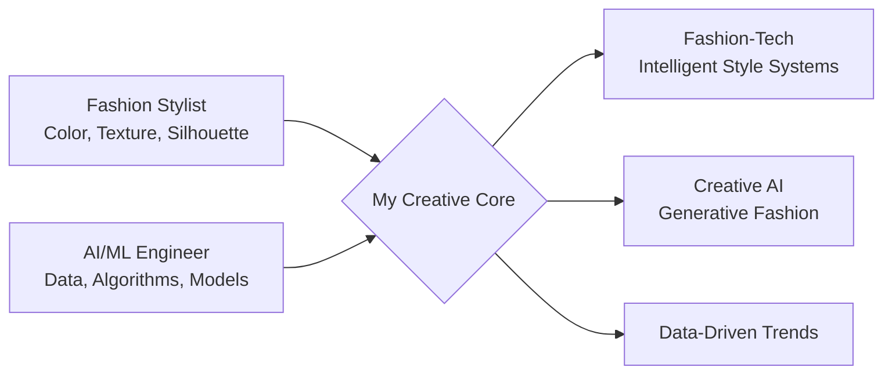

# 👗 Style & Neural Networks

> *Where fashion intuition meets artificial intelligence.*  
> *Fashion Stylist | AI Engineer in the making | Creative Technologist*

## 🎨 Fashion Meets Code: My Philosophy

Visualizing my journey at the intersection of two worlds:

## 📊 My AI & Dev Skills Dashboard

### Languages & Tools

### Current Learning Focus:
1. **Prompt Engineering** for generative design applications
2. **Fine-tuning LLMs & Diffusion Models** for aesthetic tasks
3. **Computer Vision** for style analysis and classification
4. **MLOps** for production-ready AI systems

## 🚀 Featured Projects

### 1. **Fashion Trend Forecaster (AI)**
*Trend analysis using NLP and computer vision for fashion forecasting.*
- **Tech Stack:** Python, Transformers (Hugging Face), OpenCV, Streamlit
- **Key Insight:** Applied BERT for analyzing fashion texts and trend reports.
- **Status:** 🟢 Active Development

### 2. **Personal Style Recommender**
*Machine learning system that recommends outfits based on your wardrobe.*
- **Tech Stack:** Scikit-learn, FAISS, FastAPI, Computer Vision
- **Fashion Touch:** Color palette analysis, texture recognition, silhouette matching
- **Status:** 🟡 Planning Stage

### 3. **AI Mood Board Generator**
*Generative AI creating fashion mood boards from text prompts.*
- **Tech Stack:** Stable Diffusion, CLIP, Gradio
- **Status:** 🔴 Idea Phase

## 📈 GitHub Stats & Metrics

### My Coding Activity:

### Weekly Development Breakdown:

### Most Used Languages:

### Contribution Streak:

## 🏆 GitHub Achievements & Trophies

## 📬 Let's Collaborate!
I'm always interested in:
- Fashion-tech startups looking for AI expertise
- Research collaborations at the intersection of AI and creative industries
- Speaking opportunities about fashion and technology
- Mentoring aspiring fashion technologists

## ✨ P.S. Fashion Quote of the Day

> *"Style is a way to say who you are without having to speak."* — Rachel Zoe  
> *In the AI world, this translates to: "Your model's output is its style. Prompt it with intention."*

*This README updates like a seasonal collection. Stay tuned for the next drop!*

---

  
  **Visitors Count**  
  
  
  ⚡ Powered by creativity, caffeine, and convolutional networks

